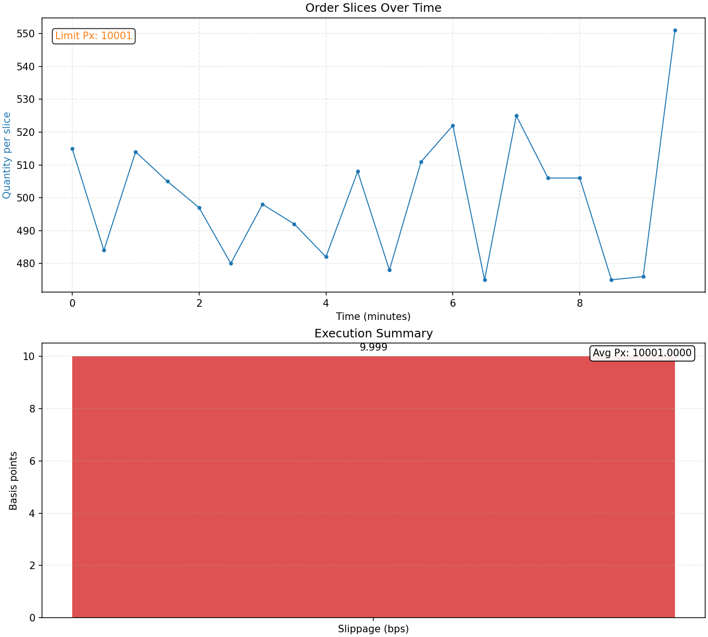

# twap_vwap_slicer


 

“C++20 TWAP/VWAP slicer with jitter, CSV I/O, and slippage metrics. Integrates with a LOB.”

“Header-only modules, no allocations in hot path, -O3 -march=native.”

“Demo completes in seconds; plots and metrics included.”



VWAP is the quantity‑weighted average price you actually traded at.

TWAP is the simple average of prices across equally spaced times.


## Overview

This project builds a simple execution schedule (TWAP by default; VWAP-style when weights are provided), emits mock orders to `orders.csv`, computes execution metrics to `summary.csv`, and optionally renders plots. It is a minimal scaffold to integrate with a real limit order book (LOB) or simulator.

## Quick start

```bash
# From repo root
mkdir -p build
cd build
cmake .. -DCMAKE_BUILD_TYPE=Release
cmake --build . -j
./twap_vwap   # writes orders.csv and summary.csv in the current dir

# Back to repo root to plot
cd ..
python -m venv plots/venv
source plots/venv/bin/activate
pip install -r requirements.txt
python plots/plot_results.py  # writes plots to plots/build/
```

## Features

- TWAP schedule across a time window (default)
- VWAP-style schedule via user-provided weights
- Jitter on per-slice quantities (default ±5%)
- Deterministic randomness (fixed seed) for reproducible runs
- CSV outputs: per-slice orders and high-level summary
- Simple metrics: average price and signed slippage (bps)
- Python plotting utility for quick visual reports

## Build

Requires CMake ≥ 3.20 and a C++20 compiler.

```bash
mkdir -p build
cd build
cmake .. -DCMAKE_BUILD_TYPE=Release
cmake --build . -j
```

This produces the binary `twap_vwap`.

## Run

From the `build/` directory:

```bash
./twap_vwap
```

Outputs (in the current working directory):
- `orders.csv`
- `summary.csv`

Defaults baked into the demo:
- Total quantity: 10,000
- Number of slices: 20
- Horizon: start 0s, end 10m (equally spaced)
- Mode: TWAP (VWAP disabled unless weights provided)
- Jitter: ±5%
- Side: buy (+1) with mock pricing around a synthetic mid

Note: The demo uses a placeholder limit price (`mid ± 1`) and a fixed `mid` of 10000 (integer price units). Replace these with your LOB quotes when integrating.

## CSV Schemas

`orders.csv`
- `ts_ns` (int64): nanoseconds since schedule start
- `qty` (int32): quantity for this slice after jitter and normalization
- `limit_px` (int32): limit price in your engine’s integer price units

`summary.csv`
- `avg_px` (float): quantity-weighted average execution price
- `slippage_bps` (float): signed slippage vs mid in basis points

Slippage sign convention: positive is unfavorable (e.g., worse for a buyer).

## Plotting

Python 3.10+ recommended.

```bash
python -m venv plots/venv
source plots/venv/bin/activate
pip install -r requirements.txt
python plots/plot_results.py \
  --orders build/orders.csv \
  --summary build/summary.csv \
  --outdir plots/build
```

Defaults aim to work from the repo root with outputs in `plots/build/`.

Artifacts:
- `plots/build/orders_plot.png`
- `plots/build/summary_plot.png`
- `plots/build/report.png`

## Configuration

Currently the demo config is set in `src/main.cpp` via `ScheduleCfg`:
- `total_qty`, `slices`, `start`, `end`
- `vwap` (false by default)
- `weights` (only used when `vwap=true`; length must equal `slices`)
- `jitter_pct` (default 0.05)

VWAP-style scheduling:
- Set `cfg.vwap = true`
- Provide `cfg.weights` with one weight per slice (e.g., expected volume profile)

Determinism:
- Jitter uses a fixed RNG seed (`std::mt19937 rgn(42)`), ensuring reproducible runs.

Final quantity normalization:
- After jitter and weighting, the last slice is adjusted to exactly match `total_qty`.

### Config example (VWAP + weights)

```cpp
#include "schedule.hpp"
#include <chrono>
#include <vector>

int main() {
    ScheduleCfg cfg;
    cfg.total_qty = 25000;
    cfg.slices = 12;
    cfg.start = std::chrono::seconds(0);
    cfg.end   = std::chrono::minutes(6);
    cfg.vwap = true;
    cfg.jitter_pct = 0.02; // ±2%
    cfg.weights = { 3, 4, 6, 8, 10, 12, 12, 10, 8, 6, 4, 3 }; // length = slices

    auto schedule = build_schedule(cfg);
    // ... submit schedule to your LOB ...
}
```

## LOB Integration Notes

- Replace the mock `mid` and `limit_px` logic with prices from your book.
- Use the generated schedule (`ts_ns`, `qty`) to time and size your orders.
- Convert `ts_ns` to your clock or scheduling system as needed.
- Consider adding CLI flags or config files for runtime parameters.

